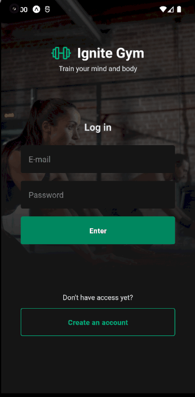
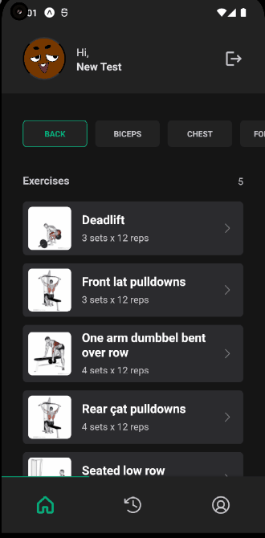
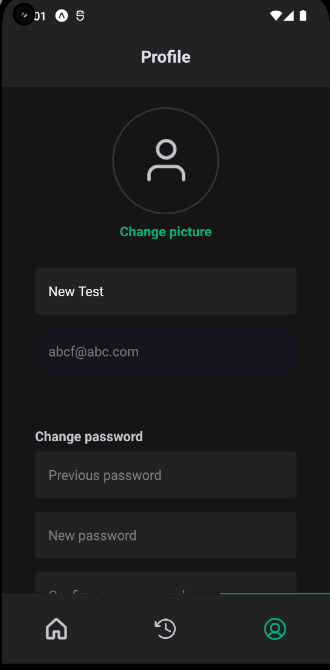
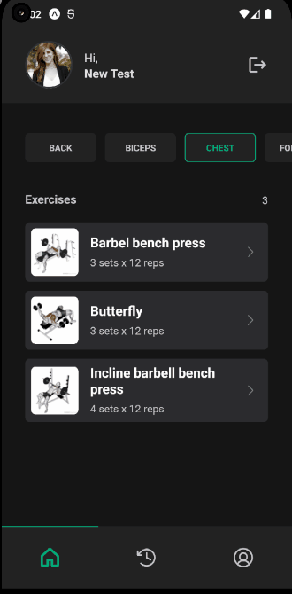

# Ignite Gym

An application consuming an api to populate the gym exercises, authentication and authorization, which is used to mark the exercises you have done in the gym that day. So you can have a better vision of your healthy behaviors.
It is using JWT for auth and refresh-tokens to improve the UX, on the mobile side we have validation being make using the YUP library.

## :runner: :computer: Running in your pc

Assuming you have installed Android Emulator and Expo, just do a `npm install` in the root directory using your terminal, then go to the backend directory typing `cd backend` then `npm install`.
After that go back to the root directory `cd ..` then run the backend `npm run backend`, open another terminal then run `npx expo start`.
The application is now running, just open your emulator to test it

## :hammer: Used techs

- ⚛️ **React-native**
- ⚛️ **Expo**
- ⚛️ **TypeScript**
- ⚛️ **Async Storage**
- ⚛️ **Native Base**
- ⚛️ **React Hook Form**
- ⚛️ **React Navigation**
- ⚛️ **Yup**
- ⚛️ **Axios**

## :camera: Auth Route

## :camera: App Route

## :camera: Overview

